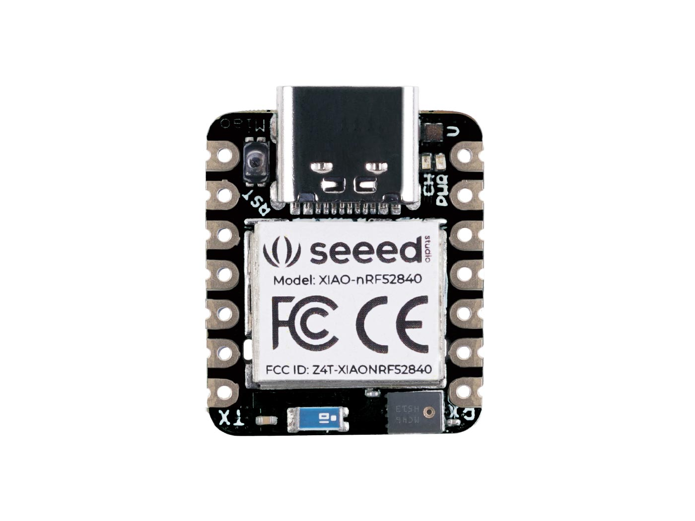

## Welcome!

This is our webpage for our ECE 196 Project - Workout Buddy!
UC San Diego - Jacobs School of Engineering
Electrical and Computering Engineering
Department of Athletics

### Problem Statement: 
Making “gains” in the gym is hard, especially when working out alone. Through loud music and intense exercises, we want to optimize workouts by tracking the quantity and quality of repetitions.

### [Meet the Team](website/AboutTeam.md)

### Solution:
We are developing a cheap wearable device that tracks repetitions.

### Design Flow:

### Components Used:

PCB Design(Left), CAD Model + PCB (Middle), Seeed nRF52480 Sense (Right)

 

### Design of Physical Device: 
Using a Seeed nRF52840, we were able to create a compact bluetooth system to measure repetitions via embedded acceleration calculations.

### Software Application: 
Using SwiftUI, we created an iOS app that provides monitoring of the user’s repetitions based on data sent by the device and provides positive or negative comments based on the user’s preference. 

### Updates:
#### [11/16 Progress Report](website/11_16_Progress_Report.md)

### Final Product:

 

 
 

### Going Forward:
Overall, we are satisfied with how our project turned out, given the time constraint. If we had more than 5 weeks, we would want to:
  * Improve rep counting algorithm
  * Reduce cost and size further
  * Outsource less components
  * Integrate OLED display
  * Monitor other elements while minimizing cost and size

### [Resources](website/resources.md)

