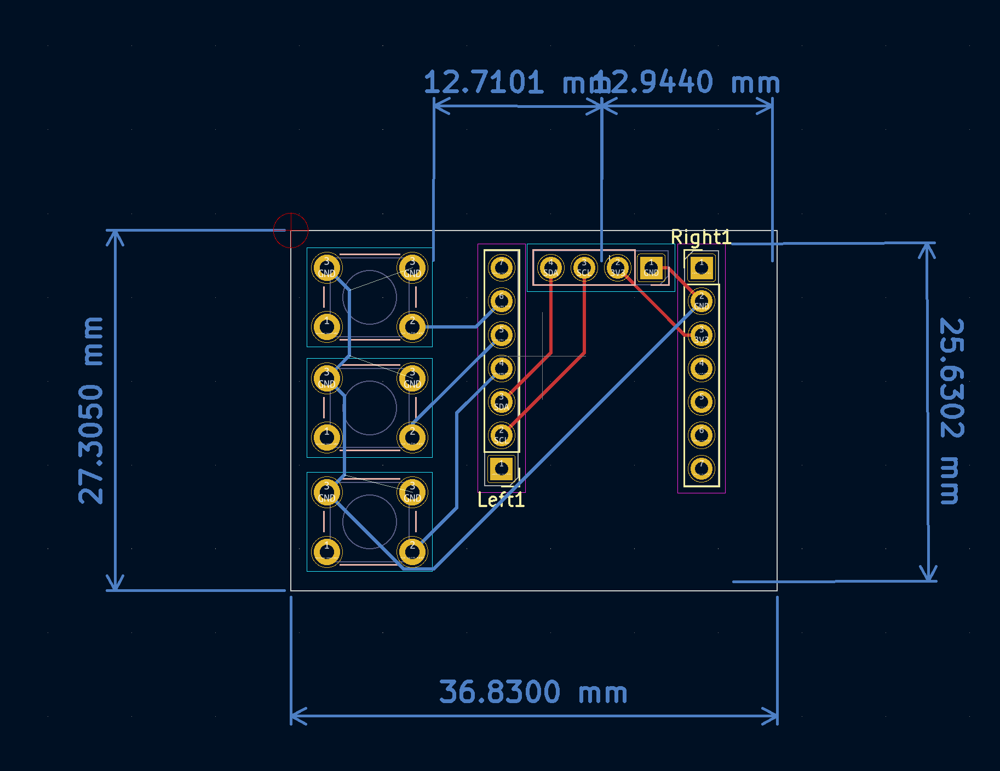

# Welcome!

This is our webpage for our ECE 196 Project - Workout Buddy!
UC San Diego - Jacobs School of Engineering
Electrical and Computering Engineering
Department of Athletics

Getting gains quickly is hard, especially when working out alone. Through the loud music and grunts, we want to optimize workouts by tracking the quantity and quality of repetitions. Of course, solutions such as Apple Watches and Kineosystem

We are creating a cheap wearable / attachable device with a accelerometer to improve workout routines. 

[Meet the Team](website/AboutTeam.md)

[11/16 Progress Report](website/11_16_Progress_Report.md)

[Resources](website/resources.md)
